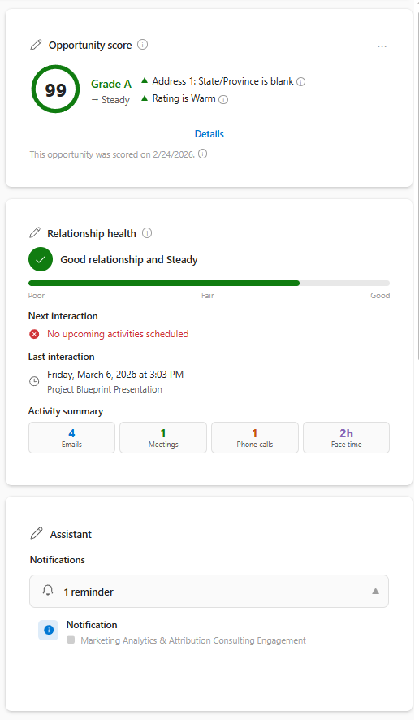
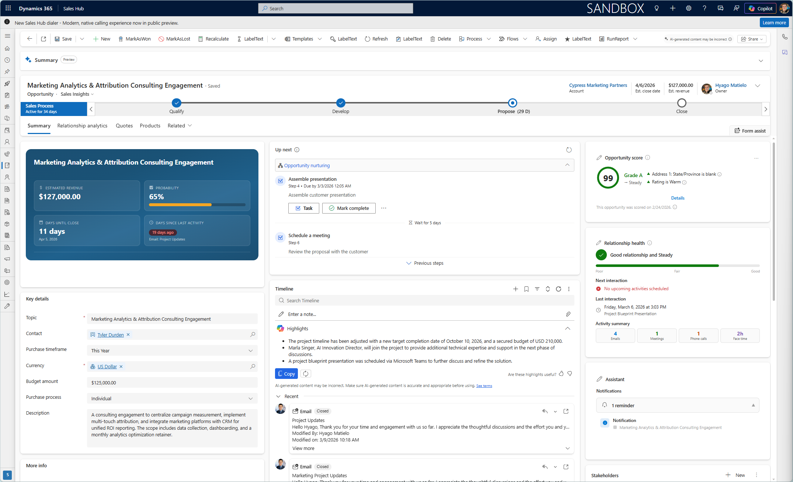

# Opportunity 360 Card for Dynamics 365

A compact opportunity profile card designed to be embedded on the Opportunity form in Microsoft Dynamics 365 Sales. Provides key deal metrics at a glance with inline editing capabilities.

## Screenshots

| Opportunity Card | Embedded in Dynamics 365 |
|:----------------:|:------------------------:|
|  |  |

## What It Does

When placed on an Opportunity record, this card displays:

- **Opportunity name** — with initials icon header.
- **KPI grid** (2×2 layout):
  - **Estimated Revenue** — inline editable, writes back to CRM
  - **Probability** — with color-coded progress bar, inline editable
  - **Days Until Close** — with editable close date picker
  - **Days Since Last Activity** — auto-calculated from the most recent activity
- **Inline editing** — click on revenue, probability, or close date to update directly. Changes save back to Dynamics 365 with toast notifications.
- **Status pills** — color-coded indicators (green/yellow/red/blue) based on deal health.

## How to Use It

1. **Upload as a Web Resource** — create a new HTML web resource using the `opportunity360.html` file.
2. **Add to the Opportunity Form** — place the web resource control on the Opportunity main form.
3. **Publish** — save and publish the form.

No additional servers or installations required. Everything runs inside Dynamics 365 using the built-in Web API.

## Requirements

- Microsoft Dynamics 365 Sales (online)

## License

[MIT](LICENSE.txt)
